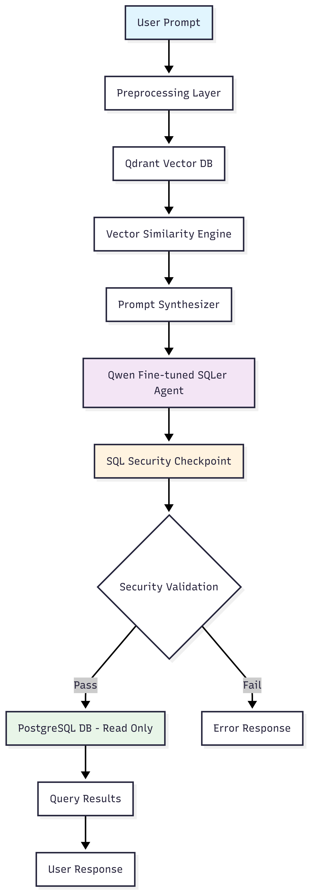
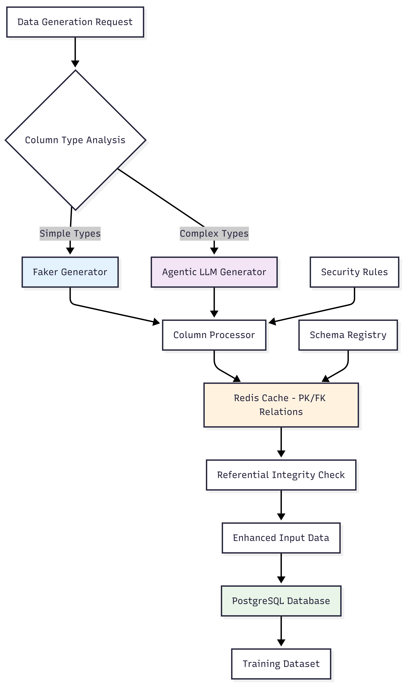
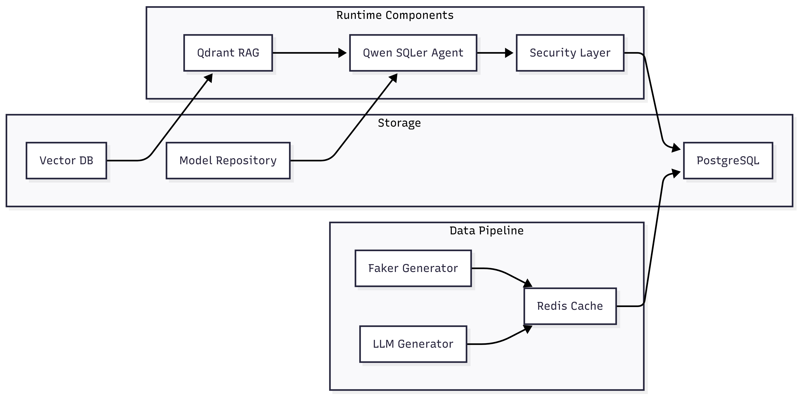

# LLM SQLer

Fine-tuning Qwen models for SQL query generation using the Spider dataset.

## Overview

This project fine-tunes Qwen2.5 models to generate SQL queries from natural language questions. Using QLoRA (4-bit quantization) for efficient training on consumer GPUs.

## Features

- **Model**: Qwen2.5-1.5B-Instruct (fine-tuned for text-to-SQL)
- **Dataset**: Spider dataset for cross-domain SQL generation
- **Training**: QLoRA with 4-bit quantization
- **Target**: Generate valid PostgreSQL SQL from natural language questions

## Installation

```bash
conda env create -f environment.yaml
conda activate llmsqler
```

## Quick Start

```bash
python src/pretraining/main_qwen_ft.py
```

## Project Structure 
```markdown
src/
├── pretraining/
│   ├── qwen_ft.py          # Model loading and LoRA config
│   ├── spider_ds.py        # Dataset tokenization
│   └── main_qwen_ft.py    # Training loop
└── tgi/
    └── __init__.py         # Text Generation Inference setup

```
## Training Configuration
- Batch Size: 2 (effective 16 with gradient accumulation)
- Learning Rate: 2e-4
- Max Steps: 300 (MVP run)
- Memory: Optimized for RTX 5060 Ti + 32GB RAM

## Training Output
```markdown
{'loss': '0.5717', 'grad_norm': '0.07471', 'learning_rate': '9.4e-06', 'entropy': '1.854', 'num_tokens': '2.133e+05', 'mean_token_accuracy': '0.8526', 'epoch': '0.4063'}
{'loss': '0.541', 'grad_norm': '0.08154', 'learning_rate': '8.733e-06', 'entropy': '1.882', 'num_tokens': '2.265e+05', 'mean_token_accuracy': '0.8546', 'epoch': '0.4317'}
{'loss': '0.5356', 'grad_norm': '0.08936', 'learning_rate': '8.067e-06', 'entropy': '1.857', 'num_tokens': '2.399e+05', 'mean_token_accuracy': '0.8645', 'epoch': '0.4571'}
{'loss': '0.5317', 'grad_norm': '0.06934', 'learning_rate': '7.4e-06', 'entropy': '1.834', 'num_tokens': '2.536e+05', 'mean_token_accuracy': '0.86', 'epoch': '0.4825'}
{'loss': '0.5276', 'grad_norm': '0.08447', 'learning_rate': '6.733e-06', 'entropy': '1.855', 'num_tokens': '2.67e+05', 'mean_token_accuracy': '0.8591', 'epoch': '0.5079'}
{'eval_loss': '0.5611', 'eval_runtime': '19.24', 'eval_samples_per_second': '36.38', 'eval_steps_per_second': '4.574', 'eval_entropy': '1.81', 'eval_num_tokens': '2.67e+05', 'eval_mean_token_accuracy': '0.8571', 'epoch': '0.5079'}
{'loss': '0.5251', 'grad_norm': '0.07959', 'learning_rate': '6.067e-06', 'entropy': '1.885', 'num_tokens': '2.801e+05', 'mean_token_accuracy': '0.8646', 'epoch': '0.5333'}
{'loss': '0.5424', 'grad_norm': '0.09521', 'learning_rate': '5.4e-06', 'entropy': '1.861', 'num_tokens': '2.932e+05', 'mean_token_accuracy': '0.8631', 'epoch': '0.5587'}
{'loss': '0.5805', 'grad_norm': '0.08154', 'learning_rate': '4.733e-06', 'entropy': '1.863', 'num_tokens': '3.063e+05', 'mean_token_accuracy': '0.8513', 'epoch': '0.5841'}
{'loss': '0.5542', 'grad_norm': '0.07861', 'learning_rate': '4.067e-06', 'entropy': '1.849', 'num_tokens': '3.197e+05', 'mean_token_accuracy': '0.8582', 'epoch': '0.6095'}
{'loss': '0.5477', 'grad_norm': '0.1006', 'learning_rate': '3.4e-06', 'entropy': '1.835', 'num_tokens': '3.331e+05', 'mean_token_accuracy': '0.8591', 'epoch': '0.6349'}
{'loss': '0.5682', 'grad_norm': '0.1001', 'learning_rate': '2.733e-06', 'entropy': '1.868', 'num_tokens': '3.464e+05', 'mean_token_accuracy': '0.8493', 'epoch': '0.6603'}
{'loss': '0.5851', 'grad_norm': '0.0835', 'learning_rate': '2.067e-06', 'entropy': '1.853', 'num_tokens': '3.601e+05', 'mean_token_accuracy': '0.8485', 'epoch': '0.6857'}
{'loss': '0.5277', 'grad_norm': '0.07617', 'learning_rate': '1.4e-06', 'entropy': '1.828', 'num_tokens': '3.736e+05', 'mean_token_accuracy': '0.8656', 'epoch': '0.7111'}
{'loss': '0.5744', 'grad_norm': '0.1016', 'learning_rate': '7.333e-07', 'entropy': '1.849', 'num_tokens': '3.869e+05', 'mean_token_accuracy': '0.854', 'epoch': '0.7365'}
{'loss': '0.5317', 'grad_norm': '0.07666', 'learning_rate': '6.667e-08', 'entropy': '1.875', 'num_tokens': '4e+05', 'mean_token_accuracy': '0.8596', 'epoch': '0.7619'}
{'eval_loss': '0.5549', 'eval_runtime': '19.33', 'eval_samples_per_second': '36.21', 'eval_steps_per_second': '4.552', 'eval_entropy': '1.808', 'eval_num_tokens': '4e+05', 'eval_mean_token_accuracy': '0.8584', 'epoch': '0.7619'}
{'train_runtime': '1063', 'train_samples_per_second': '4.517', 'train_steps_per_second': '0.282', 'train_loss': '0.6024', 'epoch': '0.7619'}
100%|████████████████████████████████████████████████████████████████████████████████| 300/300 [17:42<00:00,  3.54s/it]
```

## Architecture Diagrams

### Runtime Flow Architecture



### Data Generation Architecture




#### System component diagram

